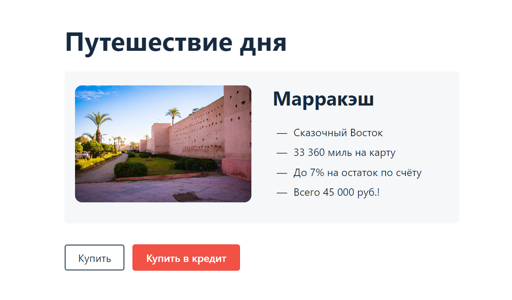

# План внедрения автоматизации тестирования комплексного веб-сервиса, взаимодействующего с СУБД и API банка.

## `Приложение предлагает купить тур по определённой цене двумя способами:`

### 1.Обычная оплата по дебетовой карте.

### 2.Уникальная технология: выдача кредита по данным банковской карты.

Приложение в собственной СУБД должно сохранять информацию о том, успешно ли был совершён платёж и каким способом.

## Проект - автоматизация тестирования покупки по дебетовой карте.

`Проект включает`:

1.План автоматизации.[Plan.md](https://github.com/ITgynQA/CourseWork/blob/main/docs/Plan.md)

2.Автотесты:

* UI-тесты и запросы в базу данных, проверяющие корректность внесения информации приложением.
* API-тесты.
* Репорты — Allure.

3.Отчет по итогам тестирования. [Report.md](https://github.com/ITgynQA/CourseWork/blob/main/docs/Report.md)

4.Отчет по итогам автоматизации. [Summary.md](https://github.com/ITgynQA/CourseWork/blob/main/docs/Summary.md)

### Начало работы

*Клонирование репозитория*

* На GitHub.com перейти на главную страницу репозитория.
* Над списком файлов щелкнуть "Код". Скопировать URL-адрес репозитория.
* Открыть GIT Bash.
* Изменить текущий рабочий каталог на расположение, где должен находиться клонированный каталог.
* Ввести <git clone> и вставить URL-адрес, скопированный ранее.
* Нажать "ВВОД", чтобы создать локальный клон.

### Prerequisites

Для использования проекта на ПК необходимо установить:

* `Браузер`- Google Chrome. 
* `Git` - Cистему управления версиями.
* `Java`- для автоматизации тестирования приложения.
* `IntelliJ IDEA` - среду разработки на языке java.
* `Gradle` - систему для автоматизации сборки приложения.
* `jUnit-5` - платформу для запуска автотестов.
* `Docker Desktop`- платформу для развертывания приложений.
* `MySQL` - систему управления базами данных.
* `Docker`- плагин в IDEA для запуска контейнеров из приложения.
* `Database Navigator` - плагин в IDEA для подключения к БД. 
* `Allure`- фреймворк для создания отчётов автотестов.
* `Selenid` - фреймворк для автоматизации тестирования.
* `Postman` - сервис для тестирования API.

### Установка и запуск

1.Склонировать репозиторий с GitHub.com.

2.Запустить программу Docker Desktop.

3.Открыть проект в IntelliJ IDEA.

4.Запуск контейнеров  <docker-compose up>

5.Запуск джар-файла  <java -jar .\artifacts\app-deadline.jar>

6.Запуск тестов  <./gradlew clean test --info>

7.Запуск генерации отчетов allure  <./gradlew allureServe>

