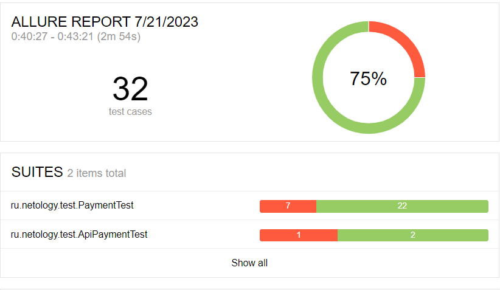
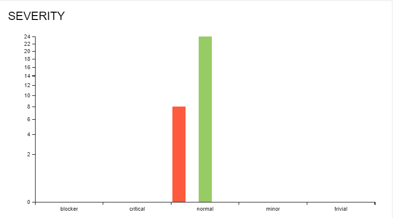
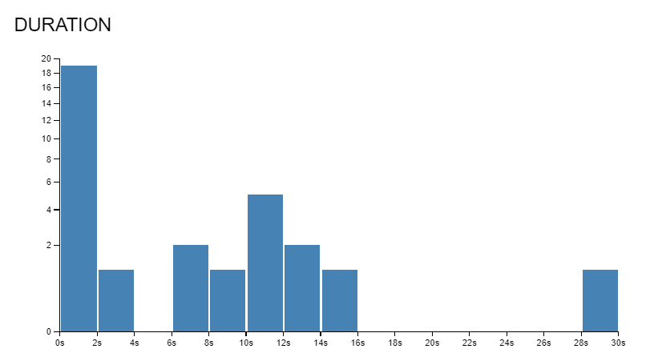

# Отчет по итогам тестирования.

## Описание

### Проведено автоматизированное тестирование веб- сервиса по покупке тура, взаимодействующего с СУБД и API Банка.

#### Всего выполнено автоматизированных тест - кейсов  `32`:

##### Успешных - `24`- 75%

##### Неуспешных -`8`- 25%

### Allure -репорт:

### Баг - репорты:

(https://github.com/ITgynQA/CourseWork/issues)

### Рекомендации

* Составить документацию на тестируемое приложение с подробным описанием поведения форм заполнения и сохранения данных в СУБД

* Исправить дефектов, найденные при тестировании
